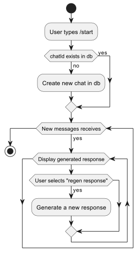

### Improvements can be done
- [ ] implement custom AuthenticationProvider like EmailAuthenticationProvider
- [ ] Decouple monolith with microservices (Telegram service, Auth service, Admin service)
- [ ] Use Oauth2 Authorization Server with Authorization Client
- [ ] Use WebHook instead of polling
- [ ] Use Markups
- [x] Use transactions in TelegramGPTBot
- [ ] Add error handling to WebClient
- [x] Fix regen messages - only new messages can do it!